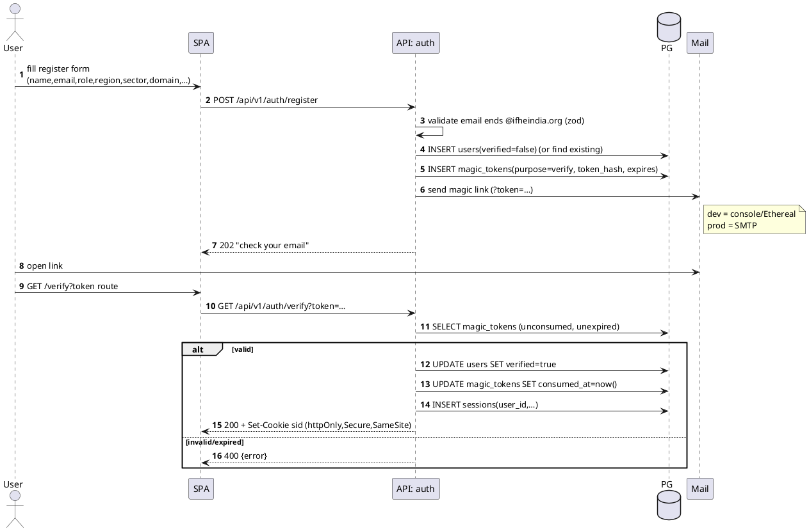
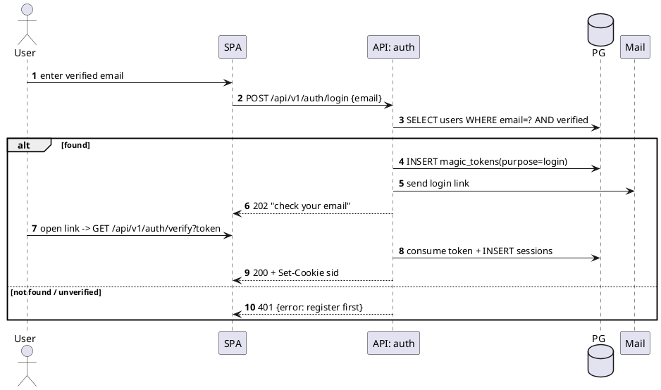
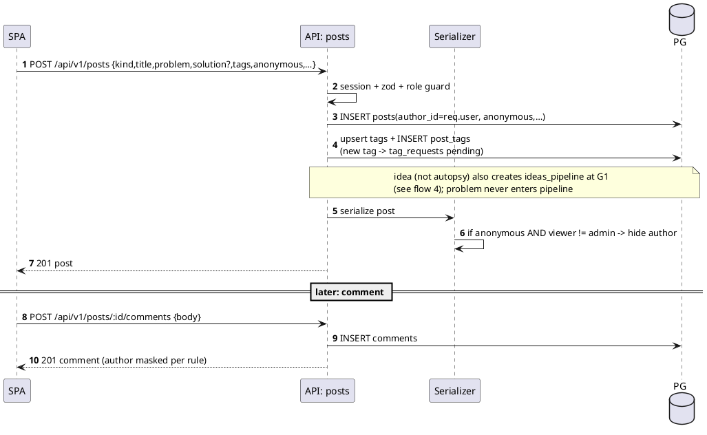
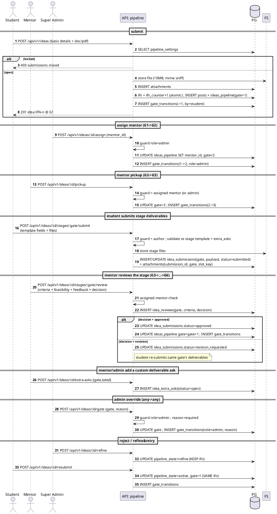
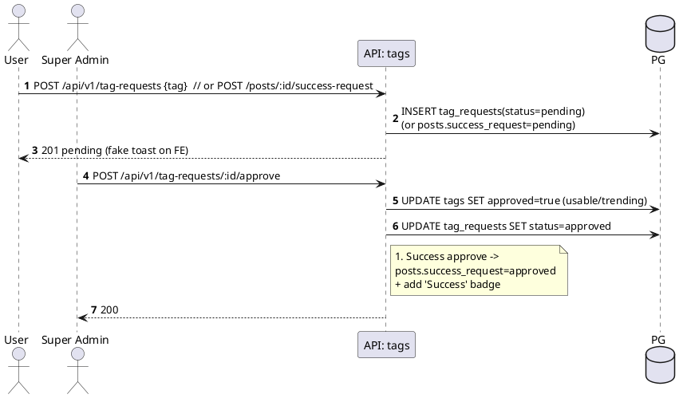
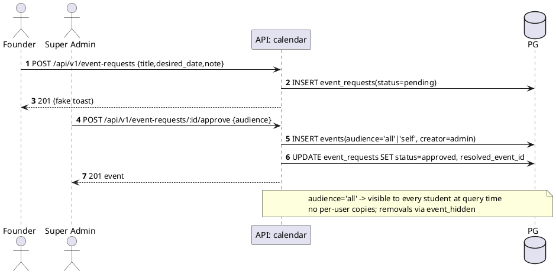
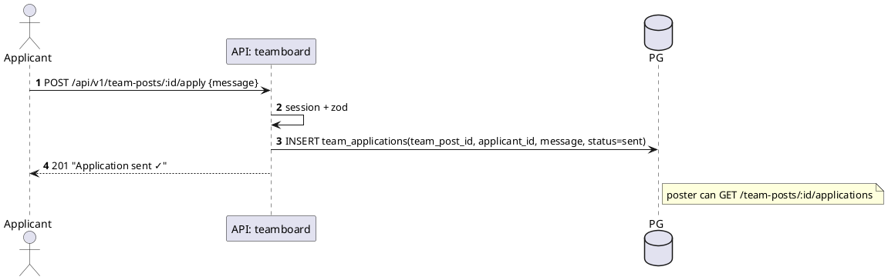
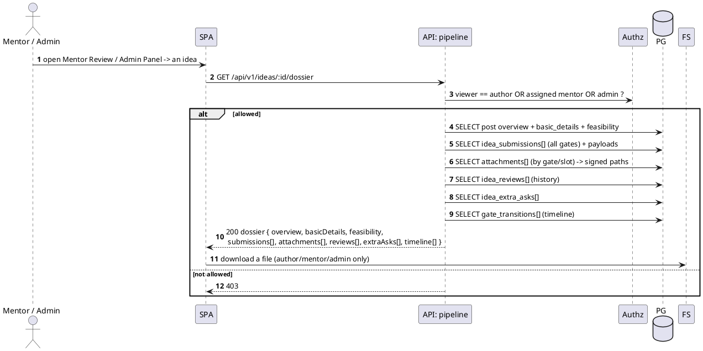

# IFN Backend — Sequence Flows

PlantUML sequence diagrams for the critical IFN backend flows. Participants: **SPA** (React),
**API** (the relevant Express module), **PG** (Postgres), **Mail** (mailer), **FS** (file storage).

See [[IFN Backend Index]] · [[IFN Backend — Architecture]] · [[IFN Backend — Data Model]].

## 1. Register → verify → session (magic-link)
/home/basil/drive/obsidian/Lumenor/IFN Backend/IFN Backend — Architecture.md

## 2. Passwordless login

## 3. Create post (+ anonymous masking) and comment

## 4. Pipeline — submit → assign → pickup → **per-stage deliverables** → review → advance → override

Each gate has a deliverable template; the student submits that stage's deliverables (`idea_submissions`
+ files), the assigned mentor reviews them (`idea_reviews`), and approval advances the gate. Admin can
override any gate. See the dossier fetch in flow 8 and [[IFN Backend — Data Model]].

## 5. New-tag / #Success request → admin approval

## 6. Calendar event request → approve → add to all students

## 7. Talent Acquisition — apply

## 8. Idea dossier fetch (mentor / admin see the *full* case file)

> Replaces the old behaviour where Mentor Review / Admin Panel showed only a title + description.
> The dossier is the complete record; the public Feed still shows only the post overview.

Related: [[IFN Backend — Architecture]] · [[IFN Backend — Data Model]] · [[IFN Backend — Decisions (ADR)]]
